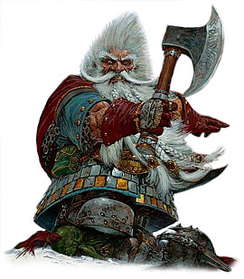

dwarf-ng
========

### -- a little and powerful object file manipulation tool and hex editor.


**dwarf-ng** is a powerful object file manipulation tool and hex editor in the spirit of _gdb_. with dwarf-ng you can read and edit all the file's section headers as well as the raw data. With dwarf-ng you can create and customize new file's header and it can be used as a compiler back-end to create executables/object files. dwarf-ng also permits to inject easily new headers and pieces of code/data into the file. dwarf-ng currently handles

* Raw
* ELF (Elf32, Elf64),
* PE (Portable executables PE32, PE+) and
* Mach-O (os x executables 32&64bit)

files format. In the future new files type will be added.


## HOWTO INSTALL

```
$ make help             #(show make options)
$ make                  #(make FLEX=osx #to build in macosx)
$ sudo make install
```

## Dependencies

* flex
* bison
* readline (libreadline libreadline-dev)
* gcc

### documentation

read the [dwarf man page](doc/xdwarf.man.html)

### dwarfrc

dwarf look for config files in sequence: `/etc/dwarfrc` and `~/.dwarfrc` .
here is an example of a config file:

```
#dwarf config file.

	work_on_tmpcopy=yes #(yes|no)
	verbose=0 #this is a comment
	tmpdir="/tmp"
	tmpname="dw_temp_filex"
	colors=yes #(yes|no) yes=normalcolor
	#theme=2  #(0=nocolor, 1=normalcolor, 2=boldcolor)

```
### usage
```
$ ./dwarf -h
dwarf-ng-0.4.0 (c) Fernando Iazeolla 2007-2013-2017.

USAGE: dwarf [options] [file]
valid options:
-s              --stdin                 file from stdin
-i              --shell --interactive   interactive (shell mode)
-h              --help                  show this help
-c '<commands>' --command '<commands>'  command  mode (execute commands)
-e '<commands>' --command '<commands>'  command  mode alias (execute commands)
-x <file>       --execute <file>        execute file script
-v              --version               show dwarf-ng's version number
-f <file>       --file <file>           open file
-p              --probe                 probe file and print file type and info
-C [n]          --colors [n]            colored output (n=theme num)
-B              --nocolors              nocolored output
-T [n]          --theme [n]             theme 2 colored output (n=theme num)
-W              --work-on-copy          work on copy file
-P              --no-work-on-copy       no work on copy file
-D <name>       --tmpdir <name>         set tmp dir path
-N <name>       --tmpname <name>        set tmp filename
-s <offs>       --seek <offs>           set seek offset
-b <size>       --block <size>          set block size
```
### demo


### dwarf-ng general commands

dwarf-ng is a powerful command line hex editor in the spirit of gdb.

##### main help

```
dwarf> ?
Append '?' to any char command to get detailed help.
general command syntax:
command[?][+] [%nx] [data] [offset]    n=times,x=format
| ?                this help
| q                exit dwarf-ng interpreter
| i                show file info and headers info.
| o[?]             open/opened file commands.
| b[?]             See / change block size.
| s[?] [addr]      seek to address.
| e[?]             show config vars.
| M[?]             move block of file around.
| p[?]             print commands.
| x[?]             just an alias for px (print hex).
| w[?]             write operations.
| S[?]             section headers operations.
| !'commands'      execute commands into shell (bash).
```

##### open/opened file help
```
open/opened files commands:
| o [%x] file               open file (o foo) (o %%w foo)(x=w write-on-copy, x=f no write-on-copy).
| oc                        close opened file.
| ol                        show opened files list.
| os                        show opened file size.
| ou  n                     switch to opened file number n
| oR  [+ -]n                resize opened file of [+ -]n bytes.
| oR+ n                     increaes size of opened file of n bytes.
| oR- n                     decreasesize of opened file of n bytes.
| oS [filename]             save file (to filename).
| oT type                   change file type to 'type' (oT elf).
| oN [%x] [filename] [!type] open new empty file [named filename] x=w (work-on-copy) x=f (no-work-on-copy).
| oP                        probe opened file type and load data struct.
| oL                        probe opened file type and load data struct.(probe (oP) alias).
| oO  [%x] filename         open filename without probing filetype and without loading data structures (x=w write-on-copy, x=f no-write-on-copy).
```

##### block size help

```
Get/Set block size
| b             display current block size
| b  33         set block size to 33
| b+ 3          increase blocksize by 3
| b- 16         decrease blocksize by 16
| b  0xfa+4     numeric argument can be an expression
```
##### seek help
```
Usage: s   #Seek commands
| s             Print current address
| s  addr       Seek to address
| s-            Undo seek
| s+            Redo seek
| s- n          Seek n bytes backward
| s+ n          Seek n bytes forward
| s--           Seek blocksize bytes backward
| s++           Seek blocksize bytes forward
| s*            List undo seek history
| s/ DATA       Search for next occurrence of 'DATA'
| s/x 9091      Search for next occurrence of \x90\x91
| ss            Seek silently (without adding an entry to the seek history)
| s             Print current address
```
##### print commands

```
dwarf> p?
print commands
| pp[?] [%nx] [@]expr     generic print function.
| px [%n][x]              hex print of n bytes from offset x.
| pxl n                   hex print n lines.
| pxx [%n][x]             hex pretty print of n bytes from offset x.
| ps [%n][x]              print a string at offset x of n len.
| pn [%x] [offs] [!%z]    print number (cC=char, sS=short(little, big endian), wW=word(little,big endian), qQ=quad) from offset in z format (d=decimal,x=hex) .
| x  [%n][x]              same as px.
| xl  n                   same as pxl.
| xx [%n][x]              same as pxx.
```
##### write commands
```
dwarf> w?
write operations commands.
append '+' to the commands to perform the operation increasing the file size (not overwriting operations).
| wx[+] [%n] '9190' [offset]          write hex 0x91 0x90 at offset max n bytes.
| ws[+] [%n] 'foo' [offset]           write string foo at offset max n chars.
| wz[+] [%n] 'foo' [offset]           write string zero terminated at offset max n chars.
| wps[+] [%np|b] 'pattern' [offset]   write string pattern n times at offset (p repeats n times the string, b repeats n times the bytes[can trunc string]).
| wpx[+] [%np|b] 'pattern' [offset]   write hex pattern n times at offset (p repeats n times the string, b repeats n times the bytes[can trunc string]).
| wf[+] [%n] ./myfile [offset]        write myfile at offset max n bytes.
| wr[+] [%n][offset]                  write random bytes at offset max n times.
| wle[+] [%1|2|4|8] number [offset]   write little endian number of 1,2,4,8 bytes at offset.
| wbe[+] [%1|2|4|8] number [offset]   write big endian number of 1,2,4,8 bytes at offset.
| wn[+] [%cCsSwWqQ] number [offset]   write number at offset (c C=1byte, s=le short(little endian 2 bytes), S=be short, w=le word, W=be word(big endian 4 bytes), q=le quad(little endian 8 bytes), Q=be quad).
| wo[?]                               write over operations commands.
```
##### write over commands
```
dwarf> wo?
write over operations commands (n=times [bytes repeated], offs=offset)
| woa [%n] expr [offs]        +=  addition (f.ex: woa 0x0102)
| woA [%n] expr [offs]        &=  and
| wos [%n] expr [offs]        -=  substraction
| wol [%n] expr [offs]        <<= shift left
| wom [%n] expr [offs]        *=  multiply
| wor [%n] expr [offs]        >>= shift right
| woo [%n] expr [offs]        |=  or
| wox [%n] expr [offs]        ^=  xor  (f.ex: wox %4 0x90 0x100)
| wo2 [offs]                  2=  2 byte endian swap
| wo4 [offs]                  4=  4 byte endian swap
| wo8 [offs]                  8=  8 byte endian swap
```

#### file types
the section name vars are available from the `i` command.

##### elf
```
main elf struct: $elf
program header: $ph[0..n]
section header: $sh[0..n]
```

##### mach-0
```
Macho main header: $mac
load command: $lc[0..n]
Macho section: $lc::sect[0..n]

main fat header: $fat
file's architectures: $arch[0..n]
```

##### PE (MZ)
```
MZEXE struct: $mz
pe main header: $pe
$pe::FileHeader
$pe::OptionalHeader
PE section: $sect[0..n]
```
#### EXAMPLES

##### var assignment
```
a=5; pp a
a=7
pp a
b=3
c=a+b+7
pp c
pp %x c		#prints c variable in hexadecimal format
```

##### structured variable
```
o myfile              #open the file
i                     #prints file's main structures
pp $elf               #prints the main elf structure (assuming an elf file :) )
pp $elf::ph_num       #prints program header's number
$elf::ph_num=7        #sets program header number
a=$sh[7]::offset      #puts into 'a' variable the 'offset' member of the 8th section header
pp $ph                #prints a list of all program header
pp $sh[0]             #prints the 1st section header details
```

##### offsets
```
pp @<       #prints the offset of the beginnig of the opened file (zero ;) )
pp @>       #prints the offset of the end of size (filesize ;) )
os          #equivalent to print @>
a=@sh[1]    #a is the offset of the beginning of the 2nd section header
c=@sh[1]<   #c=a
b=@sh[1]>   #b is the offset of the end of the 2nd section header
wx %10 '0' $sh[4]::offset   #inject 10 times the value 0 (zero) from '$sh[4]::offset' offset
wf ./vir.bin @ph[4]>        #inject the content of "vir.bin" file from the end of the 5th program header
```

##### header create
```
Sc+ ph @ph[2]>         #create a program header from the end of the 3rd program header's section 
Sc+ sh @sh[4]          #create a section header from the beginning of the 5th section and shift file so it won't overwrite data. 
                       #old $sh[4] is now $sh[5] and the section created is $sh[4]
$elf::sh_num=$elf::sh_num+1 #remember to increase the section number from the main elf header
```
##### hex editor && generic file operations
```
TODO
```

### dwarf


#### LICENSE

This program is free software; you can redistribute it and/or modify
it under the terms of the GNU General Public License as published by
the Free Software Foundation; either version 2 of the License, or
(at your option) any later version.

This program is distributed in the hope that it will be useful,
but WITHOUT ANY WARRANTY; without even the implied warranty of
MERCHANTABILITY or FITNESS FOR A PARTICULAR PURPOSE.  See the
GNU General Public License for more details.

You should have received a copy of the GNU General Public License
along with this program. If not, see <http://www.gnu.org/licenses/>.
    
